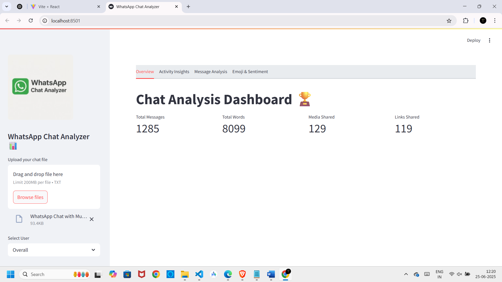
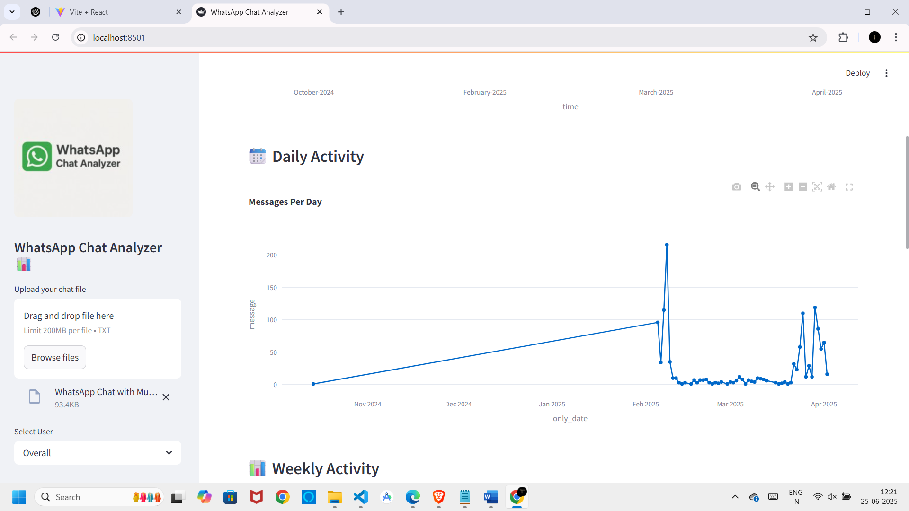
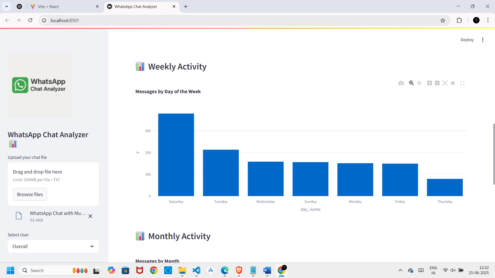
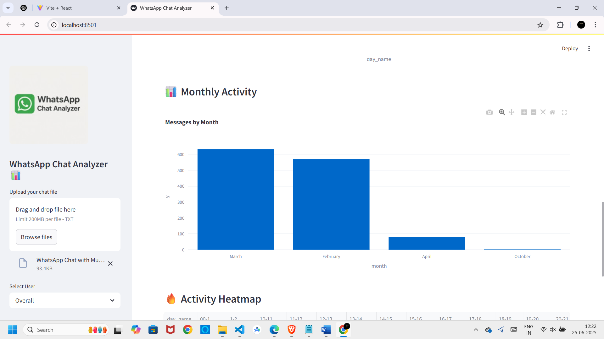
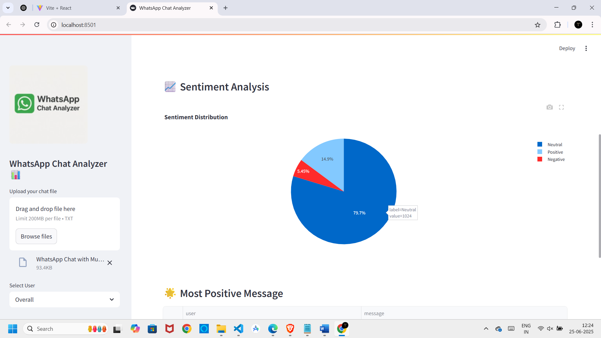
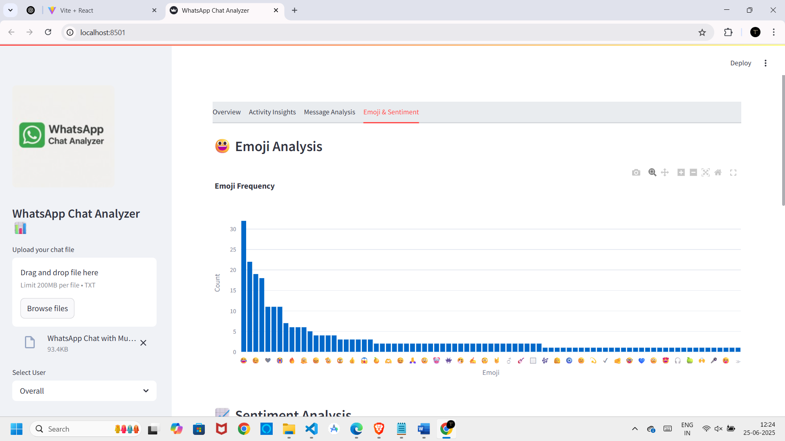

# 💬 WhatsApp Chat Analyzer with Sentiment Analysis

A Python + Streamlit web app that analyzes WhatsApp chat exports and gives detailed insights into message activity, most active users, common words, emoji usage, and the emotional tone of the conversation using sentiment analysis.

---

## Features

- Upload `.txt` file exported from WhatsApp
- View daily, monthly, and hourly activity trends
- Identify most active users and their message counts
- Generate word clouds and top word lists
- Analyze emoji usage per person
- Run sentiment analysis using the VADER model

---

## 🖼️ Demo Screenshots

### Overview


### Activity Timeline





### Emoji and Sentiment



---

## 🛠 Tech Stack

- **Backend & Data**: Python, Pandas, Regex, NLTK, VADER
- **Visualization**: Matplotlib, Seaborn, Plotly
- **Frontend**: Streamlit
- **Text Processing**: WordCloud, Emoji, Collections

---


---

## ▶️ How to Run the App Locally

### Step 1: Clone the Repository
```bash
git clone https://github.com/tanishapritha/WhatsApp-Chat-Analyzer-with-Sentiment-Analysis
cd WhatsApp-Chat-Analyzer-with-Sentiment-Analysis
```

### Step 2: Install Required Libraries
```bash
pip install -r requirements.txt
```

### Step 3: Run Streamlit App
```bash
streamlit run app.py
```
---


---

## 🧪 How It Works (Summary)

- Parses the .txt chat file using regular expressions
- Structures the data into a DataFrame: timestamp, sender, message
- Extracts features like hour, day, month, weekday
- Cleans messages and removes stopwords for word analysis
- Uses emoji and collections to find emoji usage
- Generates interactive visualizations and statistics using Streamlit
- Full logic is available in model.ipynb

---


---

## 🔍 Sample Input

To test the app:

1. Open WhatsApp on your phone.
2. Go to any chat (group or individual).
3. Tap the three dots (⋮) > More > Export chat.
4. Select "Without Media".
5. Save the `.txt` file and upload it in the app interface.

---
